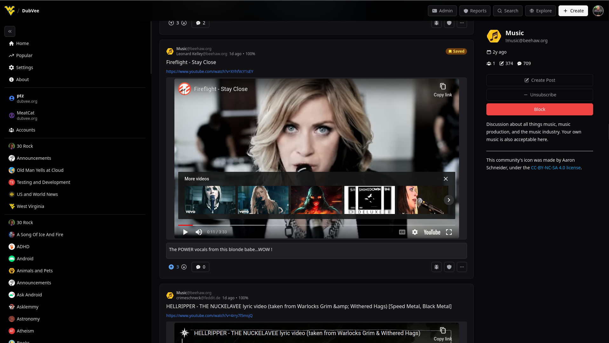
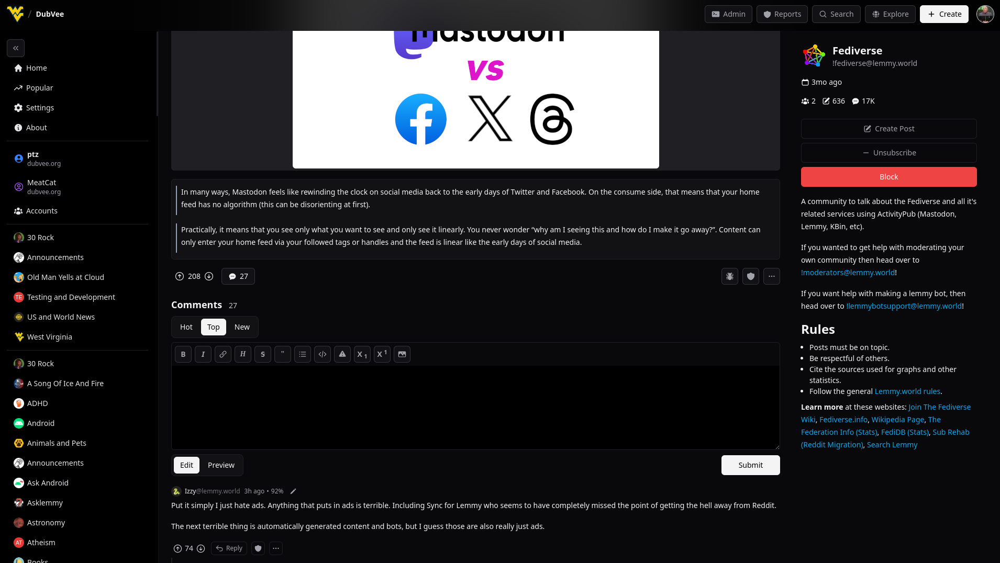
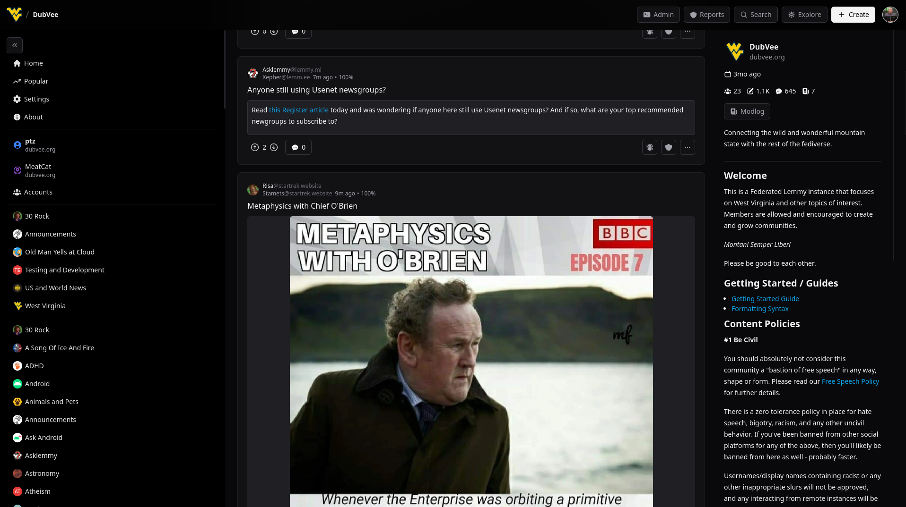
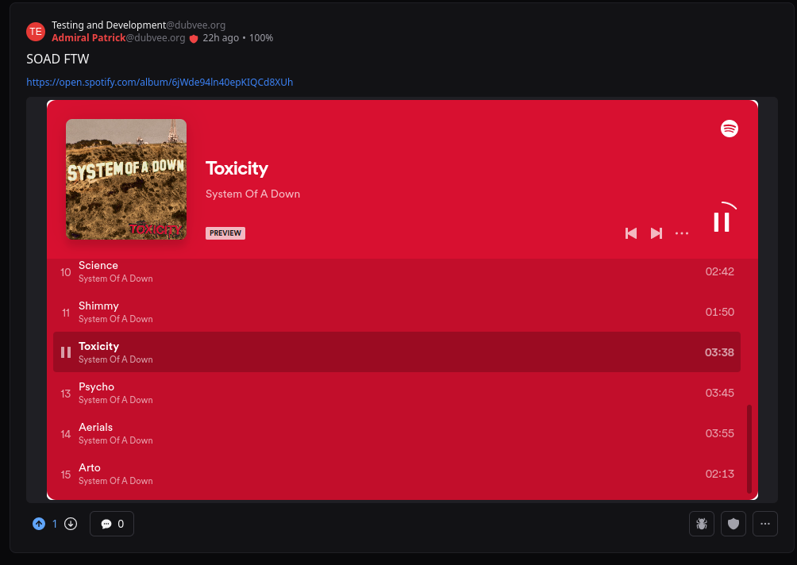
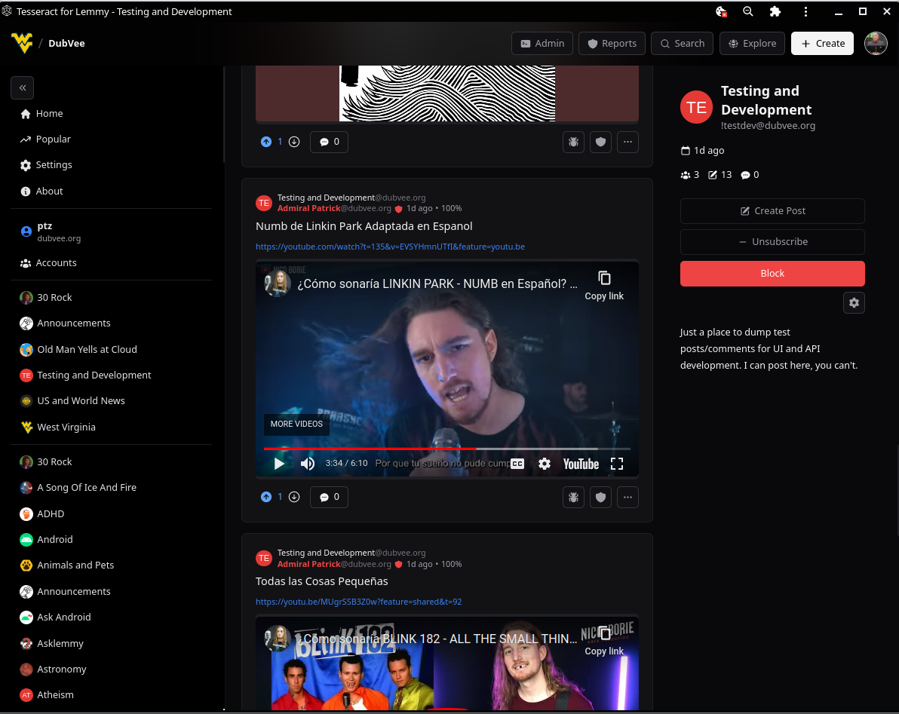

# Tesseract

Tesseract is a fork of Xylight's Photon and is designed for media-rich feeds and content.

The full list of changes can be found in the [change log](./ChangeLog.md).

## Table of Contents
- [Screenshots](#Screenshots)
- [Supported Media](#Supported-Media)
- [Get Support](#Support)
- [Roadmap](#Roadmap)
  - [Infrastructure](#Infrastructure)
  - [Community Discovery](#Community-Discovery)
  - [UI](#UI)
  - [Modlog](#Modlog)
  - [Media Handling](#Media-Handling)
- [Demo Server: Try Tesseract](#Public-Hosted-Demo-Instance)
- [Self-Hosting Tesseract](#Self-Hosting)
  - [Deploying from Docker Image](#Deploying-The-Image)
  - [Building from the Repo](#Building-From-The-Repo)
  - [Reverse Proxy Configuration](#Reverse-Proxy-Configuration)
  - [Configuring Default Settings](#Configuring-Default-Settings)
- [Donate](#Donate)


## Screen Shots
(Slightly outdated) Screenshots are available at the [bottom of the page](#Screenshots).


## Supported Media
For Youtube (and Invidious/Piped), Spotify, and Soundcloud, you don't need to use any special embed links; just the regular URL from your browser.  Tesseract will take care of generating the embed URLs based on your preferences.

- Direct video links (e.g .webm, mp4, etc) will embed a player in the feed/post. Right now, these are not toggleable as most do not have thumbnails and the bare links are ugly AF; they're treated basically like fancy image posts.  However, they only downoad enough to show the first few frames, which is acceptable from a performance/bandwidth perspective.

- YouTube and all known 
[Invidious](https://docs.invidious.io/instances/#list-of-public-invidious-instances-sorted-from-oldest-to-newest) and 
[Piped](https://github.com/TeamPiped/Piped/wiki/Instances) 
links are detected as "Youtube-like" embeddable videos.  These will embed using the user's preferred YouTube frontend which can be configured in settings. Currently, YouTube and Invidious are supported frontends, and the Invidious instance used can be chosen from your settings.

- Soundcloud track links will be detected and a player embedded. Playlists don't seem to be supported on Soundcloud's end, so unfortunately, only track links can be embedded.

- Spotify tracks, albums, and playlists will embed a player right in the feed or post.
  - (Optional) To enable full track playback rather than previews, you will need to either allow 3rd party cookies for the Tesseract domain or whitelist cookies for `open.spotify.com`. This is to allow the Spotify iframe to detect your login.
    - On mobile browsers, Spotify will only allow track previews regardless of login state so don't bother allowing 3rd party cookies.

- TikTok is not currently supported. I don't have TikTok, and no one has asked for it, so I'm content not supporting that unless there's demand and someone is able to provide me some sample links (TT does have an embed API, so at least limited support possible).


## Support
I created a public Matrix support space you can join.  General discussion, flesh out ideas, or ask for support.  [Tesseract Support](https://matrix.to/#/#tesseract-support:ptznetwork.org)

There is also a Lemmy community where you can get the latest announcements and post questions related to Tesseract.  Find us at https://dubvee.org/c/tesseract


## Roadmap 
Completed "to do"s have been moved to the [change log](./ChangeLog.md).

### Infrastructure
- [ ] Move `is[Image|Video|YouTube|Spotify|SoundCloud]` and `postType` helper functions from `ui/images.ts` to the `components/lemmy/post/helper.ts` library.
  - WIP: Refactored all of those functions, but they're still in the `images.ts` library.
- [ ] Consider an optional, complementary backend server to add additional functionality such as saving settings to DB, keeping a cache of communities/instance details for Explore features, etc.
- [ ] Consider integrating [Fediseer](https://fediseer.com/api/) support into admin tools 
  - Indicate whether posts/comments come from a guaranteed instance
  - Allow users to hide content from non-guaranteed instances
  - See cesures and endorcements of each linked instance as well as guarantor (apply SVG bage also)
  - Allow to endorse/guarantee instance from admin panel
  - Censure instance 

### Community Discovery
- [ ] Expand functionality of "Explore" to show a list of the linked instances. Selecting an instance will poll its communities and render a list you can subscribe to if logged in.
- [ ] Periodically pull the JSON DB for browse.feddit.de and use that to integrate a feidverse-wide community browser.


### Moderation
- [ ] Add "Purge person" option to admin menu
- [ ] Add option for  mods/admins to hide deleted comments and logic to implement that

### UI

#### General 
- [ ] Fix white on grey `<option>` values in theme selection menu.
- [ ] Move post action buttons to top (in line with community and OP info)

#### Vote Buttons
- [ ] Choose a vote button style and commit to it; remove unused option and its supporting code
  - Old vote style is the winner
- [ ] Add user option to select left/right side for vote buttons

#### Sidebar
- [ ] Add inline search/filter for subscribed communities.
- [ ] The community counts on the sidebar Moderating/Subscribed headers are ugly. Change those to a badge or something, I dunno.

#### Settings
- [ ] Add user preference to determine post image sizing: `small|normal|large`
- [ ] Add user setting to allow hiding posts from accounts newer than a defined period.
  - Preset intervals:  1d, 3d, 5d
  - Need to be careful with the implementation of this.  Mods/Admins should _never_ have this option enabled and be prevented from doing so as they need to be able to see and remove any content that violates laws or community/instance rules.
  - Is this even a useful feature? Spam accounts could simply sit dormant for a few days before posting anything. 
  - Legit new users may be temporarily silenced.

#### Admin Panel
- [ ] Fix /admin panel so it doesn't render for non-admins.  Granted, it's all public API data and they can't change anything, but unauth users shouldn't even see it.


### Modlog
- [ ] Enhance filtering beyond just community

### Media Handling
- [ ] Add option to "quick play" from thumbnail in feed. If embedded media disabled in feed, thumbnails will have click action replace thumbnail with lazy-loading iframe. This _should_ prevent a bunch of iframes from loading until you click the static thumbnail to reveal it while keeping quick/convenient access to media posts without leaving the feed.

- [ ] Direct videos don't have thumbnail attributes, but ones hosted via pict-rs can add ?format=webp to the URL.  Add this and enable direct videos to not be embedded if that option is set.
- [ ] Detect Youtube/Piped/Invidious links in post bodies and comments.  Optionally render those inline depending on user setting

## Public Hosted Demo Instance
An open, public demo instance is available at [https://tesseract.dubvee.org](https://tesseract.dubvee.org). Feel free to try it out with your favorite Lemmy instance.


## Self-Hosting
Tesseract is designed to be self hosted.  You can even run it from localhost if you want and connect to any Lemmy instance out there. (Note that image uploads can't work from localhost due to the CORS handler, but everything else will)


### Deploying the Image
Replace `example.com` in the line below with the base URL of your instance.  

Additional environment variables for configuring Tesseract can be found further down in the README.

`docker run -p 8080:3000 -d -e PUBLIC_INSTANCE_URL=example.com ghcr.io/asimons04/tesseract:latest`

### Building From the Repo
1. Clone the repo from a release branch
2. docker build -t tesseract:latest ./
3. `docker run -p 8080:3000 -d -e PUBLIC_INSTANCE_URL=example.com tesseract:latest`


### Reverse Proxy Configuration
**Running Tesseract Alongside Lemmy-UI**

Use this example config to get you started if you want to run Tesseract alongside Lemmy-UI (e.g. under a subdomain).  Adjust the `server_name`, SSL cert paths, and `proxy_pass` upstreams with values applicable to your deployment.

```
server {
  listen 80;
  server_name tesseract.example.com;
  location / {
    return 301 https://$host$uri?$args;
  }
}

server {
  listen 443            ssl http2;
  server_name           tesseract.example.com;
  ssl_certificate       /etc/letsencrypt/live/tesseract.example.com/fullchain.pem;
  ssl_certificate_key   /etc/letsencrypt/live/tesseract.example.com/privkey.pem;
  ssl_dhparam           /etc/nginx/tls/dhparams.pem;

  ssl_protocols         TLSv1.2 TLSv1.3;
  ssl_session_cache     shared:SSL:10m;
  ssl_session_timeout   15m;


  location / {
    proxy_pass http://127.0.0.1:8081;
  }

  # This path needs to exist so CORS headers can be relaxed for image uploads to be able to
  # function; Tesseract will proxy the requests through that to the actual backend.
  
  location /cors/ {

    # At a minimum, it is required to pass the Host header since that will need to be further 
    # passed to the lemmy backend

    proxy_http_version                      1.1;
    proxy_set_header  Host                  $host;

    # These are the response headers that will be returned on the preflight checks; required to 
    # allow multiple, arbitrary instances to be used with Tesseract without having to have too 
    # permissive a CORS policy for all routes.
    
    add_header      Access-Control-Allow-Credentials        'true';
    add_header      Access-Control-Allow-Origin             '*';
    add_header      Access-Control-Allow-Methods            'GET,OPTIONS,PATCH,DELETE,POST,PUT';
    add_header      Access-Control-Allow-Headers            'X-CSRF-Token, X-Requested-With, Accept, Accept-Version, Content-Length, Content-MD5, Content-Type, Date, X-Api-Version';
    proxy_pass      http://127.0.0.1:8081;

  }

}
```
**Running Tesseract In Place Of Lemmy-UI**

To do:  I currently have this running on my instance but need to de-tangle the Nginx config into a proper example.  It's not much different than above, and with the addition of the /cors/ path shown above, you can just point the `proxy_pass` for lemmy-ui to Tesseract.


### Configuring default settings
The following environment variables can be set to override the default settings.  Note that all environment variables must be prefixed with `PUBLIC_` to be picked up by SvelteKit.


| Variable                        | Values              | Default Value                          |
| ------------------------------- | ------------------- | -------------------------------------- |
| PUBLIC_INSTANCE_URL             | URL                 | `beehaw.org`                           |
| PUBLIC_LOCK_TO_INSTANCE         | `bool`              | `true` if `PUBLIC_INSTANCE_URL` is set |
| PUBLIC_SSR_ENABLED              | `bool`              | `false`                                |
| PUBLIC_THEME                    | system\|dark\|light | system                                 |
| PUBLIC_EXPANDABLE_IMAGES        | `bool`              | true                                   |
| PUBLIC_MARK_READ_POSTS          | `bool`              | true                                   |
| PUBLIC_REVERT_VOTE_COLORS       | `bool`              | false                                  |
| PUBLIC_SHOW_INSTANCES_USER      | `bool`              | false                                  |
| PUBLIC_SHOW_INSTANCES_COMMUNITY | `bool`              | true                                   |
| PUBLIC_SHOW_INSTANCES_COMMENTS  | `bool`              | false                                  |
| PUBLIC_SHOW_COMPACT_POSTS       | `bool`              | false                                  |
| PUBLIC_DEFAULT_FEED_SORT        | `SortType`          | Active                                 |
| PUBLIC_DEFAULT_FEED             | `ListingType`       | Local                                  |
| PUBLIC_DEFAULT_COMMENT_SORT     | `CommentSortType`   | Hot                                    |
| PUBLIC_HIDE_DELETED             | `bool`              | true                                   |
| PUBLIC_HIDE_REMOVED             | `bool`              | false                                  |
| PUBLIC_FULL_WIDTH_LAYOUT        | `bool`              | false                                  |
| PUBLIC_EXPAND_SIDEBAR           | `bool`              | true                                   |
| PUBLIC_DISPLAY_NAMES            | `bool`              | true                                   |
| PUBLIC_NSFW_BLUR                | `bool`              | true                                   |
| PUBLIC_NEW_VOTE_BUTTONS         | `bool`              | false                                  |
| PUBLIC_ENABLE_EMBEDS            | `bool`              | true                                   |
| PUBLIC_YOUTUBE_FRONTEND         | YouTube\|Piped\|Invidious | YouTube                            |

The values for `SortType`, `ListingType`, and `CommentSortType` are defined by the lemmy-js-client library.  All of the values are case-sensitive and must match as they are defined in the type definitions of the [lemmy-js-client](https://github.com/LemmyNet/lemmy-js-client)

#### Listing Type
https://github.com/LemmyNet/lemmy-js-client/blob/main/src/types/ListingType.ts

- All
- Local
- Subscribed
- Moderator View (not implemented in Photon)

#### Sort Type
https://github.com/LemmyNet/lemmy-js-client/blob/main/src/types/SortType.ts

- Active
- Hot
- New
- Old
- TopDay
- TopWeek
- TopMonth
- TopAll
- MostComments
- NewComments
- TopHour
- TopSixHour
- TopTwelveHour (Not implemented in Tesseract)
- TopThreeMonths (Not implemented in Tesseract)
- TopSixMonths (Not implemented in Tesseract)
- TopNineMonths (Not implemented in Tesseract)
- TopYear (Not implemented in Tesseract)

#### Comment Sort Type
https://github.com/LemmyNet/lemmy-js-client/blob/main/src/types/CommentSortType.ts
- Hot
- Top
- New
- Old (not implemented in Tesseract)
- Controversial (not implemented in Tesseract)

## Screenshots
These screenshots show some of the enhancements made to the upstream project. 
_ | _ 
---|---
 YouTube videos playing inline |  Beehaw c/Music as it was meant to be
 Community sidebar added to post view.|  Post cards are much more Reddit-like
 Spotify playlist embedded|  Running as a desktop PWA

## Donate
Donate to Xylight, not me.  It's their baby, and I'm just building on top of it. You can donate at [Buy me a Coffee](https://buymeacoffee.com/xylight)

<a href="https://www.buymeacoffee.com/xylight"></a>
