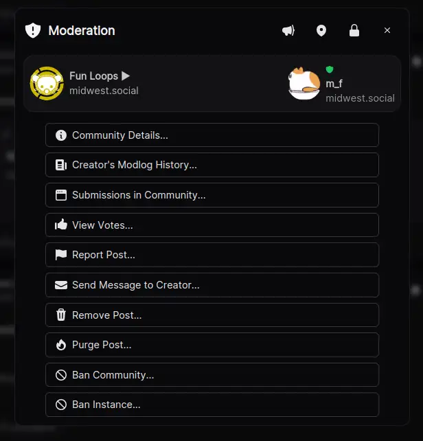
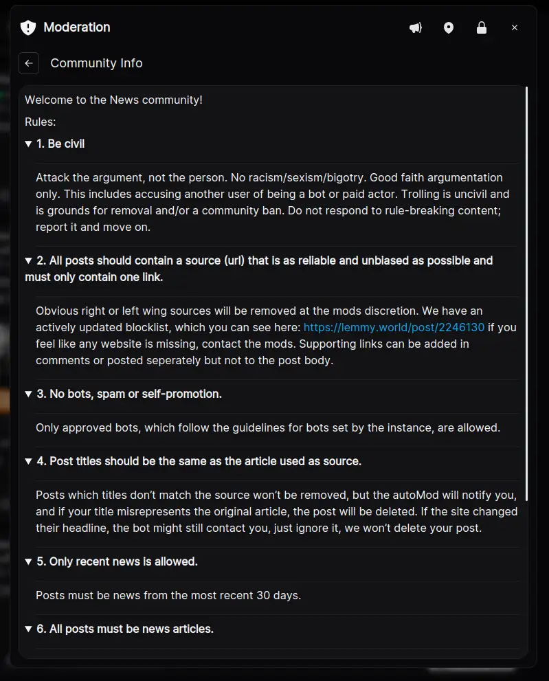
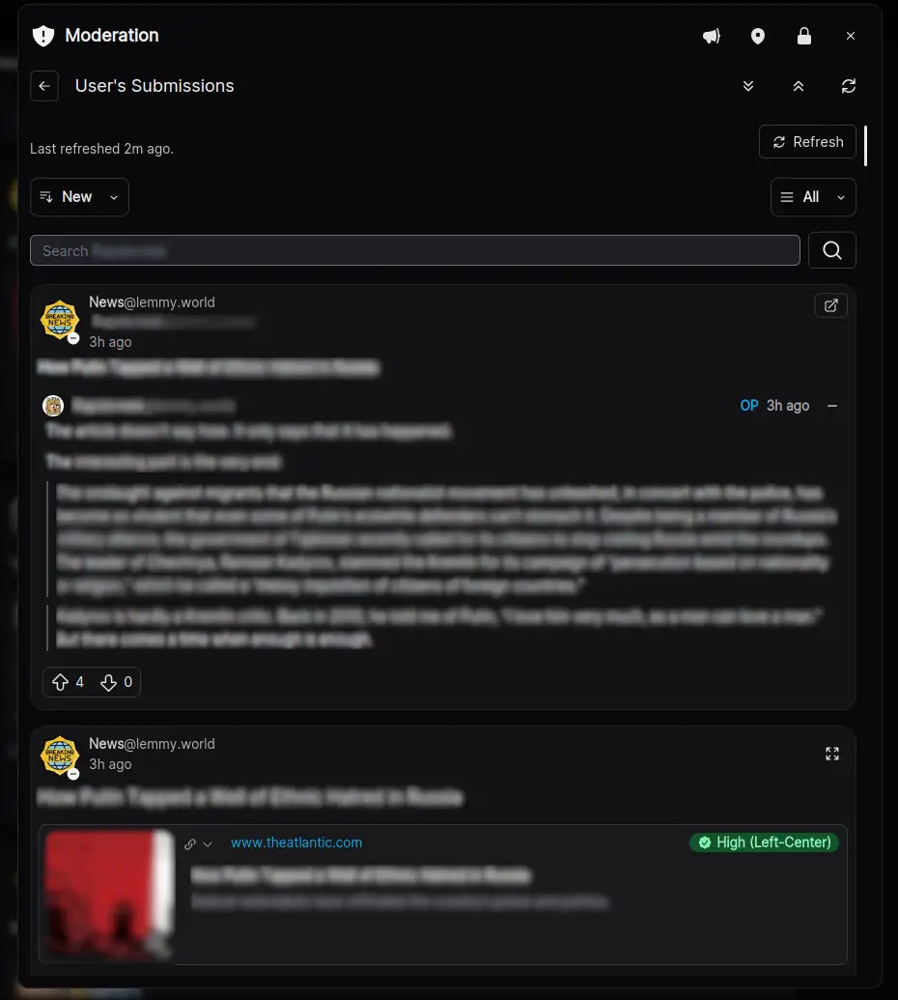
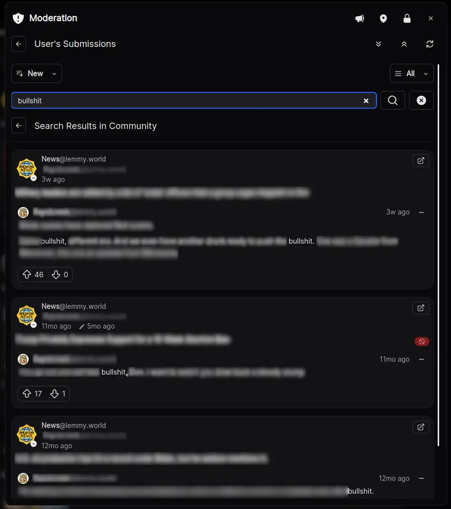
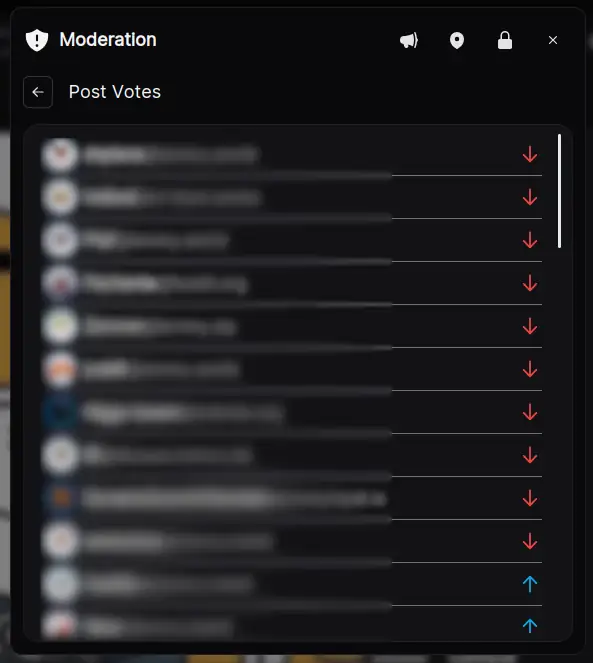
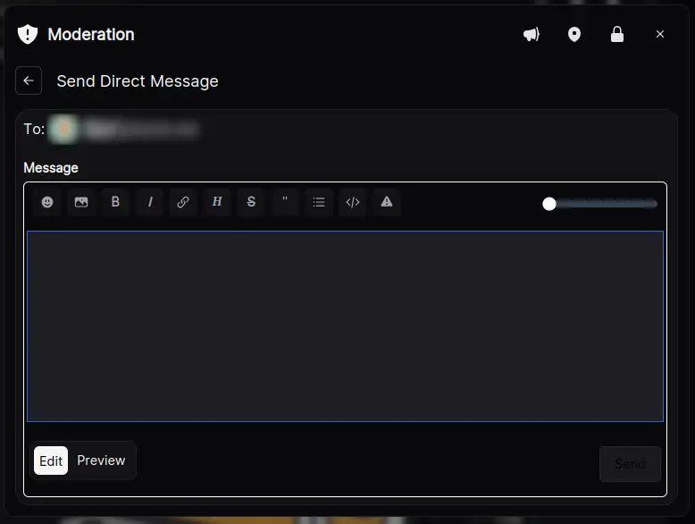
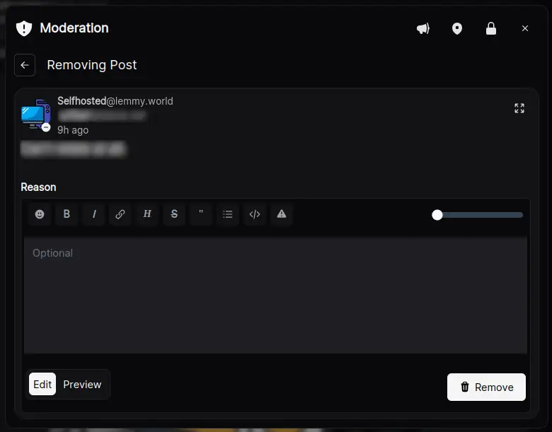
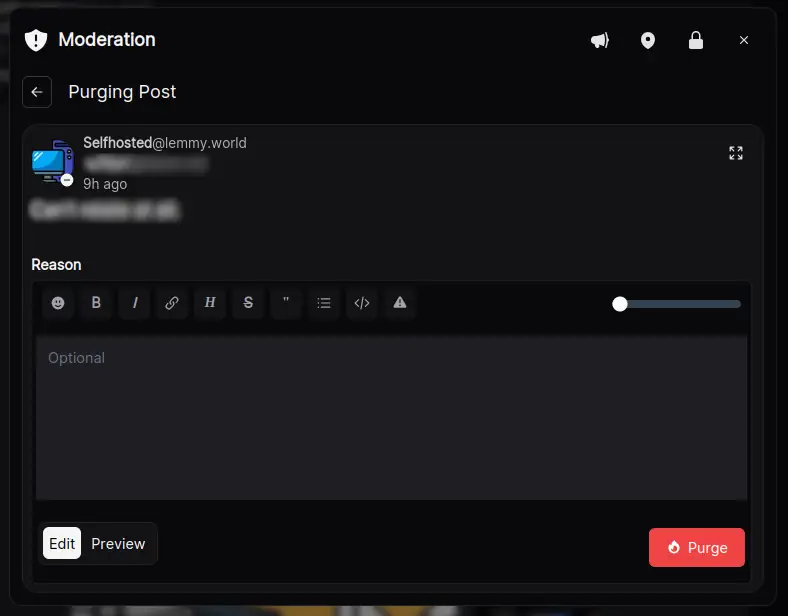
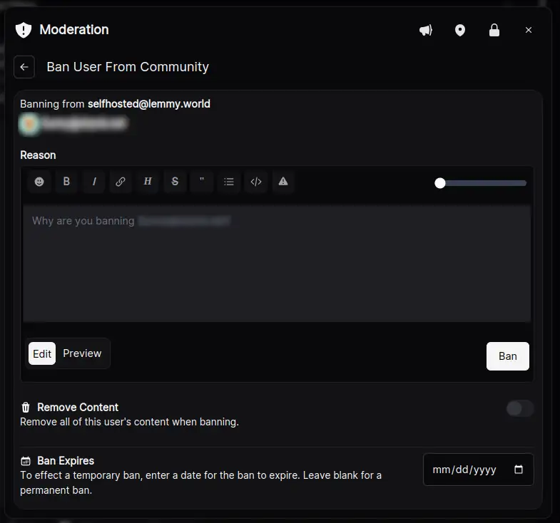
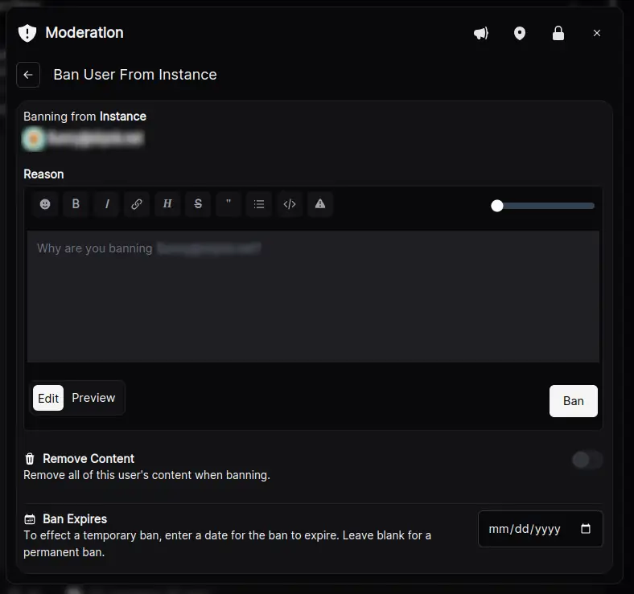

# Overview
Tesseract has a very powerful and extensive set of mod tooling.  The full toolset is available from the post, feed, profiles, inbox, and basically anywhere the posts are rendered (except when viewing a feed in a modal; the recursive modals break down there without special considerations I haven't worked in yet.)

Mod tools are accessible from the "Badge" icon on posts and comments.

- **Posts**:  Upper right corner of posts (can be hidden via setting) or Post Menu -> Moderation
- **Comments**:  Lower-right corner of comment

Clicking the menu item or button to launch the mod actions will bring up a modal.

**Note**:  Many of the screenshots in this doc will switch between different communities / users / posts.  I could use the same ones constently, but I want to cherry-pick each to best show off how Tesseract handles things. 

## Mod Modal Main Menu

In the modal title bar (to the left of the close 'x'), are toggle buttons:

- **Megaphone**:  Feature/unfeature post on instance (admin only; hidden otherwise). Highlighted green when active.
- **Map Pin**:  Pin/unpin post in community. Highlighted green when active.
- **Padlock**:  Lock/unlock post. Highlighted gold when active.

The community the item belongs to and the user who posted it are at the top.  Each of those are clickable to bring up their respective community and user profile modals.  Those can be used for additional lookups and actions without the current mod modal closing.

Each sub-screen in the modal has a left-arrow at the top.  Use that to return to the main menu.

**See Also**:
- [Community Profile Modal](CommunityProfileModal.md)
- [User Profile Modal](UserProfileModal.md)

### Community Details

Gives you a quick reference to the sidebar information for the community.  Use this to quick-reference rules when considering the mod action or setting the action reason.

The "left arrow"  button to the left of the panel title ( <- Community Info) will return you to the modal's main menu.  This is standard behavior for all modal menus.

### Creator's Modlog History

This will bring up an embedded mini-modlog inside the modal.  By default, the mini modlog will be filtered for both the community and user relevant to the mod action (e.g. the community it was submitted to and the creator of the post/comment that initiated the mod menu)

On the right side of the panel's title area is a toggle button with a newspaper icon.  

- When it says "All", clicking it will remove the community filter show you all modlog events for that user and refresh the results.
- When it says "Community", it will re-add the community filter.

Below that, there are two addition buttons:
- Another button with a newspaper icon: That will close the modal and take you to the full modlog with the filter preset to the values used in the modal.
- A box with an arror going out from the top right:  That does the same thing as above, but opens the full modlog in a new window.

This is useful to confirm or check for patterns of rule-violating behavior and assist in making a decision for what action should be taken.

**Note**:  Due to technical limitations, in the modal, none of the modlog actions are clickable like they usually are. To dig deeper, open the full modlog using one of the convenince buttons.

### Submissions in Community

Brings up an embedded feed inside the modal showing the posts and comments the user has made in the current community.  

This works exactly the same way as the "View History..." in the [User Profile Modal](./UserProfileModal.md) because it's the exact same component.  However, here, the community ID is set which filters it to the current community.

You can sort by "New", "Old", and "Top" as well as select between all submissions, just posts, or just comments.

Those selectors control both the browsing and searching behavior.  

This is searching for all submissions to `c/news@lemmy.world` from user `redacted@instance.xyz` containing the term `bullshit`.

Changing the sort or type options will re-run the search with the new parameters.

To return to the submission list, use the left arrow icon next to "Search Results in Community".

To return to the main menu, use the left arrow icon next to the panel title "User's Submissions"

### Post/Comment Votes (Admins Only)

View the upvotes and downvotes for the current item.  Useful to check for things like vote manipulate, brigading/downvote trolling.

Currently this is only accessible to admins. I think I read there's either a request or PR to let mods have this capability on their communities.  Once that's implemented, it's a simple thing to allow this for mods in Tesseract if they're connected to an instance on the necessary API level.

### Report Post (Admins Only)

Quick access to a post/comment report form.  

The reason this is admin only is because this is the moderation modal, and it wouldn't make sense for a mod to report it to themselves.

Admins can moderate anything coming into their instance (though those actions don't federate unless they're also a mod of that community).  Often, it's useful to both report a submission while also removing it locally without leaving the mod tools.  

This is purely a convenience feature, but I've found it quite useful as an admin.

### Send Direct Message

Allows you to quickly send a DM to the post/comment's creator.  Useful for things like:
- Asking them to correct a minor infraction in their submission before removing it.
- Letting them know they've been banned/unbanned
- Asking for context/clarification before making a mod decision

### Remove/Restore Post/Comment

**Note**: I'll use "Post" in the verbiage, but it also applies to and will say "Comment" if the item is a comment.  Just trying to keep the docs concise. 

Depending on the item's current state, the button may say either "Restore Post" or "Remove Post" as appropriate.

For posts, only the metadata (community, user, published/edited date, and ttile) is shown.  For comments, the full comment is shown as well as the metadata.  The comment will be in a scrollable div to keep the modal sanely-sized.

Provide an optional but recommended reason for the restore/remove, and click the action button to issue it.

**Note**:  Tesseract supports markdown for modlog messages, but that's not universal across all Lemmy clients (though it *ought to be*).  That said, try to keep the markdown simple so it's easily readble in less capable clients.

### Purge Post/Comment (Admins Only)

Purge the post/comment from the system.

Unless you've banned the user or the community's home instance has banned the user / removed the item, purging *will* cause it to be restored if anyone votes/comments on it from another instance.

Only purge a submission if you *must*.  Posts aren't so bad, but comments will screw up the aggregate counts and leave "ghost" comments that seem to exist but will fail to load.

### Ban/Unban Community

Depending upon the user's current community ban status, the button, verbiage, and behavior can be either Ban or Unban from the community.

Ban, permanently or temporarily, the user from the community or unban the user if they are currently banned.

There is a toggle to remove all of the user's submissions from the community during the ban process (AFAIK, no way to reverse that on an unban unless it's in one of the much newer API versions).

A permanent ban is the "default".  To effect a temporary ban, use the date selector to choose a date when the ban should expire.

### Ban/Unban Instance (Admins Only)

Depending upon the user's current instance ban status, the button, verbiage, and behavior can be either Ban or Unban from the instance.

Behaves the same as the ban/unban community form, except the actions apply at the instance level.

